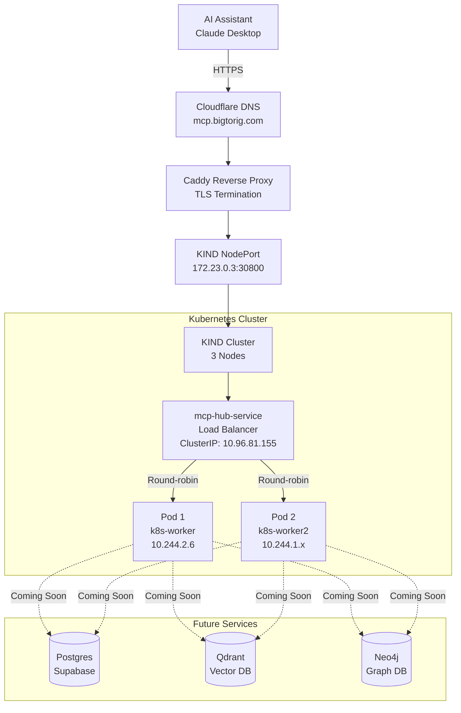

# 🔌 bigtorig-mcp-hub

**Model Context Protocol (MCP) Server for Hostinger Infrastructure**

A production-grade FastMCP server deployed on Kubernetes (KIND), providing unified access to cognitive infrastructure services on `bigtorig.com`. This MCP hub enables Claude and other AI assistants to interact with your self-hosted stack through a highly available, auto-scaling architecture.

[](https://modelcontextprotocol.io)
[](https://github.com/jlowin/fastmcp)
[](https://kind.sigs.k8s.io/)

**🌐 Live Endpoint:** `https://mcp.bigtorig.com/sse`

---

## 📋 Table of Contents

- [Overview](#-overview)
- [Architecture](#-architecture)
- [Current Status](#-current-status)
- [Available Tools](#-available-tools)
- [Deployment](#-deployment)
- [Kubernetes Benefits](#-kubernetes-benefits)
- [Usage](#-usage)
- [Development Roadmap](#-development-roadmap)
- [Troubleshooting](#-troubleshooting)
- [Resources](#-resources)

---

## 🌍 Overview

### What is bigtorig-mcp-hub?

This repository demonstrates a **production-grade MCP server** deployment on Kubernetes, showcasing the benefits of container orchestration over Docker-only deployments. It serves as:

1. **Infrastructure Foundation** - Kubernetes-based deployment architecture
2. **High Availability Demo** - Self-healing, load-balanced, multi-replica setup
3. **Extensibility Platform** - Ready to add database tools (Postgres, Qdrant, Neo4j)

### Part II of MCP Server Journey

This is **Part II** of a two-part tutorial:

- **Part I** ([01.mcp-server](../01.mcp-server/)): Docker-only deployment with 8 practical monitoring tools
- **Part II** (this project): Kubernetes deployment showcasing orchestration benefits

**Key Insight:** Part I showed what MCP can do. Part II shows how to deploy it for production.

---

## 🏗️ Architecture

### Infrastructure Topology



### Deployment Stack

| Layer | Component | Purpose |
|-------|-----------|---------|
| **DNS** | Cloudflare | Domain management |
| **TLS** | Caddy | HTTPS termination |
| **Orchestration** | KIND (Kubernetes) | Container orchestration |
| **Load Balancer** | Kubernetes Service | Traffic distribution |
| **Application** | FastMCP (Python) | MCP protocol server |
| **Runtime** | Python 3.11 + UV | Fast dependency management |

### Kubernetes Resources

```yaml
Deployment: mcp-hub
├── Replicas: 2 (can scale to 10+)
├── Image: bigtorig-mcp-hub:latest
├── Resources:
│   ├── Requests: 100m CPU, 128Mi RAM
│   └── Limits: 500m CPU, 512Mi RAM
└── Environment: Secrets from mcp-hub-secrets

Service: mcp-hub-service
├── Type: NodePort
├── Port: 8000 (internal)
├── NodePort: 30800 (external)
└── Selector: app=mcp-hub

Secret: mcp-hub-secrets
├── postgres-user
├── postgres-password
├── qdrant-api-key
├── neo4j-user
└── neo4j-password
```

---

## 📊 Current Status

### Phase 1: Foundation ✅ COMPLETE

**Focus:** Kubernetes infrastructure and deployment architecture

**Delivered:**
- ✅ 3-node KIND cluster (1 control-plane, 2 workers)
- ✅ Docker image built and loaded into cluster
- ✅ Kubernetes Deployment with 2 replicas
- ✅ NodePort Service with load balancing
- ✅ Secrets management for credentials
- ✅ Caddy reverse proxy at `https://mcp.bigtorig.com/sse`
- ✅ External HTTPS access via Cloudflare
- ✅ Self-healing demonstrated (auto pod replacement)
- ✅ Horizontal scaling demonstrated (2→3→2 replicas)

**Current Tools:** 2 foundational tools
1. `health_check` - Server health status
2. `list_services` - Infrastructure service inventory

### Phase 2: Database Integration 🔄 PLANNED

**Focus:** Add production database tools

**Planned Tools:**

**Postgres (Supabase):**
- `postgres_query` - Execute SQL queries
- `postgres_list_tables` - List database tables
- `postgres_describe_table` - Table schema inspection

**Qdrant (Vector Database):**
- `qdrant_search` - Semantic vector search
- `qdrant_list_collections` - List vector collections
- `qdrant_collection_info` - Collection metadata

**Neo4j (Graph Database):**
- `neo4j_query` - Execute Cypher queries
- `neo4j_list_nodes` - List nodes by label
- `neo4j_get_relationships` - Explore graph relationships

### Phase 3: Advanced Features 🔮 FUTURE

- Horizontal Pod Autoscaler (automatic scaling)
- Advanced health probes (liveness + readiness)
- Prometheus metrics export
- Multi-environment deployments (dev, staging, prod)
- CI/CD pipeline integration

---

## 🧰 Available Tools

### 1. health_check

**Purpose:** Verify MCP server health status

**Returns:**
```json
{
  "status": "healthy",
  "service": "bigtorig-mcp-hub",
  "version": "0.1.0",
  "message": "MCP hub is operational"
}
```

**Example Usage:**
```
User: "Check if the bigtorig MCP hub is healthy"
Claude: Uses health_check tool
Result: Server is operational, version 0.1.0
```

**Equivalent Command:**
```bash
kubectl get pods -l app=mcp-hub
kubectl logs deployment/mcp-hub --tail=5
```

---

### 2. list_services

**Purpose:** List available infrastructure services and their status

**Returns:**
```json
{
  "total_services": 3,
  "services": {
    "postgres": {
      "name": "Supabase Postgres",
      "endpoint": "db:5432",
      "status": "available",
      "tools": ["Coming soon"]
    },
    "qdrant": {
      "name": "Qdrant Vector Database",
      "endpoint": "qdrant:6333",
      "status": "available",
      "tools": ["Coming soon"]
    },
    "neo4j": {
      "name": "Neo4j Graph Database",
      "endpoint": "neo4j:7687",
      "status": "available",
      "tools": ["Coming soon"]
    }
  }
}
```

**Example Usage:**
```
User: "What infrastructure services are available in bigtorig?"
Claude: Uses list_services tool
Result: 3 services ready (Postgres, Qdrant, Neo4j) with tools coming soon
```

**Equivalent Command:**
```bash
kubectl get svc -n default | grep -E "postgres|qdrant|neo4j"
```

---

## 🚀 Deployment

### Prerequisites

- ✅ Hostinger server with SSH access
- ✅ KIND cluster running (3-node setup recommended)
- ✅ Docker installed
- ✅ kubectl configured for KIND cluster
- ✅ Caddy reverse proxy running
- ✅ Domain configured (mcp.bigtorig.com → server IP)

### Quick Start

```bash
# 1. Navigate to project directory
cd /home/charles/projects/02-StreamableHTTP-mcp-server/02.bigtorig-mcp-hub

# 2. Build Docker image
docker build -t bigtorig-mcp-hub:latest .

# 3. Load into KIND cluster
kind load docker-image bigtorig-mcp-hub:latest --name k8s

# 4. Create Kubernetes secrets
kubectl apply -f k8s/secrets-example.yaml
# (Edit secrets-example.yaml with real credentials first)

# 5. Deploy to Kubernetes
kubectl apply -f k8s/deployment.yaml
kubectl apply -f k8s/service.yaml

# 6. Verify deployment
kubectl get pods -l app=mcp-hub
kubectl get svc mcp-hub-service

# 7. Configure Caddy (add to Caddyfile)
# mcp.bigtorig.com {
#     reverse_proxy http://172.23.0.3:30800
# }

# 8. Reload Caddy
docker exec caddy caddy reload --config /etc/caddy/Caddyfile

# 9. Test external access
curl -I https://mcp.bigtorig.com/sse
```

**Expected result:** HTTP/2 200 with `content-type: text/event-stream`

For detailed deployment instructions, see [DEPLOYMENT.md](./DEPLOYMENT.md).

---

## ⚡ Kubernetes Benefits

### What You Get with Kubernetes (vs Docker-only)

| Feature | Part I (Docker) | Part II (Kubernetes) | Benefit |
|---------|----------------|---------------------|---------|
| **Replicas** | 1 container | 2+ pods | High availability |
| **Auto-Healing** | Manual restart | Automatic | Zero-touch recovery |
| **Load Balancing** | None | Service LB | Traffic distribution |
| **Scaling** | Manual | `kubectl scale` | Easy horizontal scaling |
| **Updates** | Downtime required | Rolling updates | Zero downtime |
| **Secrets** | .env file | Kubernetes Secrets | Encrypted storage |
| **Distribution** | Single host | Multi-node | Fault tolerance |

### Demonstrated Benefits

#### 1. Self-Healing
```bash
# Delete a pod
kubectl delete pod mcp-hub-64c475c6b-gdq8x

# Watch automatic recreation
kubectl get pods -l app=mcp-hub
# New pod created in 3 seconds! Service never went down.
```

#### 2. Horizontal Scaling
```bash
# Scale to 3 replicas
kubectl scale deployment mcp-hub --replicas=3

# Instant: 3 pods running across cluster
kubectl get pods -l app=mcp-hub -o wide
```

#### 3. Load Balancing
```bash
# All requests go through Service
curl https://mcp.bigtorig.com/sse
# Traffic automatically distributed across pods
```

For detailed comparisons, see [KUBERNETES-BENEFITS.md](./KUBERNETES-BENEFITS.md).

---

## 💻 Usage

### Claude Desktop Configuration

Add to `claude_desktop_config.json`:

```json
{
  "mcpServers": {
    "bigtorig-hub": {
      "command": "npx",
      "args": [
        "mcp-remote",
        "https://mcp.bigtorig.com/sse"
      ]
    }
  }
}
```

**Location:**
- Windows: `%APPDATA%\Claude\claude_desktop_config.json`
- macOS: `~/Library/Application Support/Claude/claude_desktop_config.json`
- Linux: `~/.config/Claude/claude_desktop_config.json`

After adding, **restart Claude Desktop completely**.

### Testing Tools

#### Test 1: Health Check
```
User: "Check if the bigtorig MCP hub is healthy"

Expected: 
{
  "status": "healthy",
  "service": "bigtorig-mcp-hub",
  "version": "0.1.0"
}
```

#### Test 2: List Services
```
User: "What infrastructure services are available in bigtorig?"

Expected: 
3 services listed (Postgres, Qdrant, Neo4j) with endpoints and future tools
```

### Manual Testing (Without Claude)

```bash
# Test with mcp-remote directly
npx mcp-remote https://mcp.bigtorig.com/sse

# Should see:
# [PID] Using automatically selected callback port: XXXXX
# [PID] Connecting to remote server: https://mcp.bigtorig.com/sse
# [PID] Connected successfully
```

---

## 🗺️ Development Roadmap

### ✅ Phase 1: Foundation (COMPLETE)

- [x] KIND cluster setup (3 nodes)
- [x] Docker image with FastMCP
- [x] Kubernetes deployment (2 replicas)
- [x] NodePort service
- [x] Secrets management
- [x] Caddy reverse proxy
- [x] HTTPS via Cloudflare
- [x] Basic tools (health_check, list_services)

### 🔄 Phase 2: Database Integration (IN PROGRESS)

**Postgres Tools:**
- [ ] Connect to Supabase Postgres
- [ ] Implement `postgres_query`
- [ ] Implement `postgres_list_tables`
- [ ] Implement `postgres_describe_table`
- [ ] Add connection pooling

**Qdrant Tools:**
- [ ] Connect to Qdrant vector DB
- [ ] Implement `qdrant_search`
- [ ] Implement `qdrant_list_collections`
- [ ] Implement `qdrant_collection_info`

**Neo4j Tools:**
- [ ] Connect to Neo4j graph DB
- [ ] Implement `neo4j_query`
- [ ] Implement `neo4j_list_nodes`
- [ ] Implement `neo4j_get_relationships`

### 🔮 Phase 3: Advanced Features (PLANNED)

**Observability:**
- [ ] Prometheus metrics export
- [ ] Grafana dashboards
- [ ] Structured logging
- [ ] Distributed tracing

**Scaling & Performance:**
- [ ] Horizontal Pod Autoscaler (HPA)
- [ ] Vertical Pod Autoscaler (VPA)
- [ ] Resource optimization
- [ ] Connection pooling

**Reliability:**
- [ ] Liveness probes
- [ ] Readiness probes
- [ ] Circuit breakers
- [ ] Rate limiting

**Integration:**
- [ ] n8n workflow triggers
- [ ] Flowise agent interaction
- [ ] mem0 memory API
- [ ] Langfuse observability

---

## 🔧 Troubleshooting

### Common Issues

#### Pods Not Starting

```bash
# Check pod status
kubectl get pods -l app=mcp-hub

# Check pod events
kubectl describe pod -l app=mcp-hub

# Check logs
kubectl logs -l app=mcp-hub --tail=50
```

**Common causes:**
- Image not loaded into KIND: `kind load docker-image bigtorig-mcp-hub:latest --name k8s`
- Missing secrets: `kubectl get secret mcp-hub-secrets`
- Resource constraints: Check node resources with `kubectl top nodes`

#### Service Not Accessible

```bash
# Check service
kubectl get svc mcp-hub-service

# Test from within cluster
kubectl run -it --rm test-curl --image=curlimages/curl --restart=Never \
  -- curl -I http://mcp-hub-service:8000/sse

# Test NodePort
curl -I http://172.23.0.3:30800/sse
```

#### Caddy Not Routing

```bash
# Check Caddy logs
docker logs caddy --tail=50

# Verify Caddy config
docker exec caddy caddy validate --config /etc/caddy/Caddyfile

# Reload Caddy
docker exec caddy caddy reload --config /etc/caddy/Caddyfile
```

For detailed troubleshooting, see [TROUBLESHOOTING.md](./TROUBLESHOOTING.md).

---

## 📊 Monitoring & Operations

### Check Deployment Status

```bash
# Overview
kubectl get deployments,pods,svc -l app=mcp-hub

# Detailed pod info
kubectl get pods -l app=mcp-hub -o wide

# Resource usage
kubectl top pods -l app=mcp-hub
```

### View Logs

```bash
# All pods
kubectl logs -l app=mcp-hub --tail=50

# Follow logs (real-time)
kubectl logs -l app=mcp-hub -f

# Specific pod
kubectl logs mcp-hub-64c475c6b-xxxxx
```

### Scaling Operations

```bash
# Scale up
kubectl scale deployment mcp-hub --replicas=5

# Scale down
kubectl scale deployment mcp-hub --replicas=2

# Auto-scaling (future)
kubectl autoscale deployment mcp-hub --min=2 --max=10 --cpu-percent=80
```

### Update Deployment

```bash
# Rebuild image
docker build -t bigtorig-mcp-hub:latest .

# Load into KIND
kind load docker-image bigtorig-mcp-hub:latest --name k8s

# Rolling update (restarts pods with new image)
kubectl rollout restart deployment/mcp-hub

# Watch rollout
kubectl rollout status deployment/mcp-hub
```

---

## 🔐 Security

### Current Security Measures

1. **Secrets Management**
   - Credentials stored in Kubernetes Secrets
   - Base64 encoded at rest
   - Injected as environment variables

2. **Network Security**
   - Internal services not exposed publicly
   - HTTPS only via Cloudflare + Caddy
   - NodePort only accessible within cluster network

3. **Resource Limits**
   - CPU and memory limits enforced
   - Prevents resource exhaustion
   - Fair resource allocation

### Planned Security Enhancements

- [ ] Add authentication/authorization layer
- [ ] Implement rate limiting
- [ ] Add request validation
- [ ] Enable network policies
- [ ] Add pod security policies

---

## 📚 Resources

### Official Documentation

- [Model Context Protocol (MCP)](https://modelcontextprotocol.io)
- [FastMCP Framework](https://github.com/jlowin/fastmcp)
- [Kubernetes Documentation](https://kubernetes.io/docs/)
- [KIND Documentation](https://kind.sigs.k8s.io/)
- [Caddy Documentation](https://caddyserver.com/docs/)

### Related Projects

- [ai-infra-hostinger](https://github.com/mindset-dev/ai-infra-hostinger) - Infrastructure documentation
- [01.mcp-server](../01.mcp-server/) - Part I: Docker-based MCP server

### Learning Resources

- [Kubernetes by Example](https://kubernetesbyexample.com/)
- [Kubernetes Patterns](https://k8spatterns.io/)
- [MCP Specification](https://spec.modelcontextprotocol.io/)

---

## 🤝 Contributing

This is a showcase project demonstrating Kubernetes deployment patterns for MCP servers. Contributions are welcome!

### Development Workflow

1. Make changes locally
2. Build and test Docker image
3. Load into KIND cluster
4. Test deployment
5. Submit PR with documentation updates

---

## 📄 License

MIT License - see LICENSE file for details

---

## 🎯 Project Structure

```
02.bigtorig-mcp-hub/
├── README.md                  ← You are here
├── DEPLOYMENT.md              ← Detailed deployment guide
├── KUBERNETES-BENEFITS.md     ← Part I vs Part II comparison
├── TROUBLESHOOTING.md         ← Common issues and solutions
├── Dockerfile                 ← Container build
├── pyproject.toml             ← Python dependencies (UV)
├── .env.example               ← Environment template
├── .gitignore                 ← Git ignore rules
├── src/
│   └── server.py              ← FastMCP server (2 tools)
└── k8s/
    ├── deployment.yaml        ← Kubernetes deployment
    ├── service.yaml           ← NodePort service
    └── secrets-example.yaml   ← Secrets template
```

---

## 📞 Support

**Issues:** Report issues at [GitHub Issues](https://github.com/mindset-dev/bigtorig-mcp-hub/issues)

**Documentation:** Check other .md files in this repository

**Infrastructure Docs:** [ai-infra-hostinger](https://github.com/mindset-dev/ai-infra-hostinger)

---

<div align="center">

**Part of the [mindset-dev](https://github.com/mindset-dev) cognitive infrastructure ecosystem**

🔗 [Infrastructure Docs](https://github.com/mindset-dev/ai-infra-hostinger) • 🌐 [Blog](https://journeyman33.github.io/k8s-resume-blog/) • ☸️ [Part I](../01.mcp-server/)

**Current Status:** Phase 1 Complete ✅ | Production-Ready Infrastructure | 2 Tools Available

</div>
