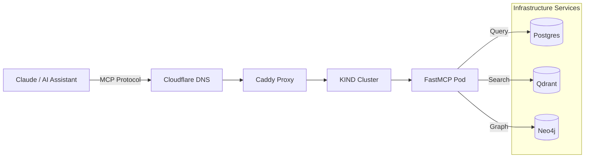

# 🔌 bigtorig-mcp-hub

**Model Context Protocol (MCP) Server for Hostinger Infrastructure**

A FastMCP-based server providing unified access to cognitive infrastructure services running on `bigtorig.com`. This MCP hub enables Claude and other AI assistants to interact directly with your self-hosted stack.

[](https://modelcontextprotocol.io)
[](https://github.com/jlowin/fastmcp)
[](https://kind.sigs.k8s.io/)

---

## 🌍 What is bigtorig-mcp-hub?

This repository contains the **MCP server** that provides AI assistants with structured access to your self-hosted infrastructure:

- 🗄️ **Postgres (Supabase)** - Database queries and schema exploration
- 🧬 **Qdrant** - Vector search and embedding management
- 🕸️ **Neo4j** - Graph database queries and relationship traversal

All services are accessible via the unified endpoint: **`mcp.bigtorig.com`**

---

## 🏗️ Architecture



### Deployment Flow
1. **External Access:** `mcp.bigtorig.com` → Cloudflare → Caddy reverse proxy
2. **Internal Routing:** Caddy → KIND NodePort → FastMCP Pod
3. **Service Integration:** FastMCP → Infrastructure services via internal endpoints

---

## 🚀 Quick Start

### Prerequisites
- Python 3.11+
- [UV](https://github.com/astral-sh/uv) - Universal Python package manager
- Access to Hostinger infrastructure (internal deployment)

### Local Development

```bash
# Clone the repository
git clone https://github.com/mindset-dev/bigtorig-mcp-hub.git
cd bigtorig-mcp-hub

# Install dependencies with UV
uv sync

# Run the MCP server locally
uv run python src/server.py
```

### Environment Variables

Create a `.env` file with your service credentials:

```bash
# Postgres (Supabase)
POSTGRES_HOST=db
POSTGRES_PORT=5432
POSTGRES_USER=postgres
POSTGRES_PASSWORD=your_password
POSTGRES_DB=postgres

# Qdrant
QDRANT_HOST=qdrant
QDRANT_PORT=6333
QDRANT_API_KEY=your_api_key

# Neo4j
NEO4J_URI=bolt://neo4j:7687
NEO4J_USER=neo4j
NEO4J_PASSWORD=your_password
```

---

## 🧰 Available Tools

The MCP server exposes the following tools to AI assistants:

### 🗄️ Postgres Tools
- `postgres_query` - Execute SQL queries
- `postgres_list_tables` - List all tables in database
- `postgres_describe_table` - Get table schema and column info

### 🧬 Qdrant Tools
- `qdrant_search` - Semantic vector search
- `qdrant_list_collections` - List all vector collections
- `qdrant_collection_info` - Get collection metadata

### 🕸️ Neo4j Tools
- `neo4j_query` - Execute Cypher queries
- `neo4j_list_nodes` - List nodes by label
- `neo4j_get_relationships` - Explore graph relationships

---

## 🐳 Kubernetes Deployment

The MCP server runs as a containerized application on the Hostinger KIND cluster.

### Deploy to KIND

```bash
# Build Docker image
docker build -t bigtorig-mcp-hub:latest .

# Load image into KIND cluster
kind load docker-image bigtorig-mcp-hub:latest --name k8s

# Apply Kubernetes manifests
kubectl apply -f k8s/deployment.yaml
kubectl apply -f k8s/service.yaml

# Verify deployment
kubectl get pods -l app=mcp-hub
kubectl get svc mcp-hub-service
```

### Access the Service

**Internal (within cluster):**
```
http://mcp-hub-service:8000
```

**External (via NodePort):**
```
http://<node-ip>:30800
```

**Public (via Caddy):**
```
https://mcp.bigtorig.com
```

---

## 🔧 Configuration

### Caddy Configuration

Add this block to your `Caddyfile`:

```caddyfile
mcp.bigtorig.com {
    reverse_proxy http://172.23.0.3:30800
}
```

Replace `172.23.0.3` with your KIND control-plane IP.

### Kubernetes Service

The MCP hub uses a **NodePort** service for simplicity:
- **Internal Port:** 8000
- **NodePort:** 30800

---

## 📊 Usage Examples

### Using Claude Desktop

Add this to your Claude Desktop MCP configuration:

```json
{
  "mcpServers": {
    "bigtorig-hub": {
      "command": "curl",
      "args": [
        "-X", "POST",
        "https://mcp.bigtorig.com/tools",
        "-H", "Content-Type: application/json"
      ]
    }
  }
}
```

### Query Examples

**Postgres:**
```python
# List all tables
postgres_list_tables()

# Query users
postgres_query("SELECT * FROM users LIMIT 10")
```

**Qdrant:**
```python
# Search embeddings
qdrant_search(collection="documents", query_vector=[...], limit=5)
```

**Neo4j:**
```python
# Find relationships
neo4j_query("MATCH (n)-[r]->(m) RETURN n, r, m LIMIT 10")
```

---

## 🛠️ Development

### Project Structure

```
bigtorig-mcp-hub/
├── src/
│   ├── server.py           # FastMCP server entrypoint
│   ├── tools/
│   │   ├── postgres.py     # Postgres MCP tools
│   │   ├── qdrant.py       # Qdrant MCP tools
│   │   └── neo4j.py        # Neo4j MCP tools
│   └── config.py           # Configuration management
├── k8s/
│   ├── deployment.yaml     # Kubernetes deployment
│   └── service.yaml        # NodePort service
├── tests/
│   └── test_tools.py       # Tool tests
├── Dockerfile
├── pyproject.toml          # UV project config
├── README.md
└── .env.example
```

### Adding New Tools

1. Create a new tool file in `src/tools/`
2. Define FastMCP tool functions
3. Import and register in `src/server.py`
4. Update documentation

---

## 🧪 Testing

```bash
# Run tests
uv run pytest

# Test individual tools
uv run pytest tests/test_tools.py::test_postgres_query
```

---

## 🚀 Roadmap

**Phase 1: Foundation** ✅
- [x] FastMCP server setup
- [x] Kubernetes deployment
- [x] Basic Postgres, Qdrant, Neo4j tools

**Phase 2: Expansion** 🔄
- [ ] n8n workflow triggers
- [ ] Flowise agent interaction
- [ ] mem0 memory API integration
- [ ] Observability via Langfuse

**Phase 3: Advanced** 🔮
- [ ] Multi-tool orchestration
- [ ] Authentication and rate limiting
- [ ] Federated MCP across multiple servers

---

## 🔐 Security

- All service credentials stored in Kubernetes secrets
- Internal services not exposed publicly
- MCP endpoint behind Cloudflare + Caddy TLS
- Read-only access by default for safety

---

## 📚 Resources

- [MCP Specification](https://modelcontextprotocol.io)
- [FastMCP Documentation](https://github.com/jlowin/fastmcp)
- [ai-infra-hostinger](https://github.com/mindset-dev/ai-infra-hostinger) - Infrastructure docs

---

## 🤝 Contributing

This is part of the mindset-dev cognitive infrastructure showcase. Contributions welcome!

1. Fork the repository
2. Create a feature branch
3. Submit a pull request

---

## 📄 License

MIT License - see LICENSE file for details

---

<div align="center">

**Part of the [mindset-dev](https://github.com/mindset-dev) cognitive infrastructure ecosystem**

🔗 [Infrastructure Docs](https://github.com/mindset-dev/ai-infra-hostinger) • 🌐 [Blog](https://journeyman33.github.io/k8s-resume-blog/)

</div>
